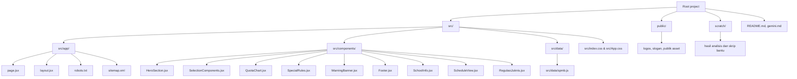
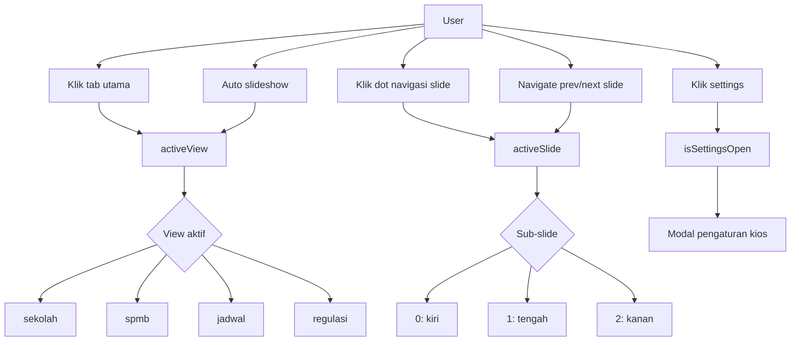
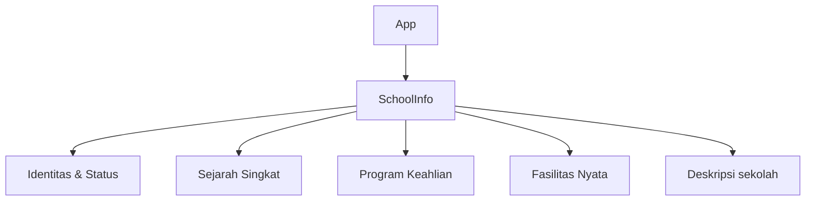
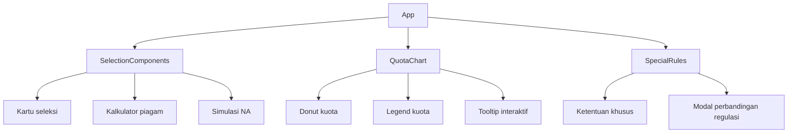
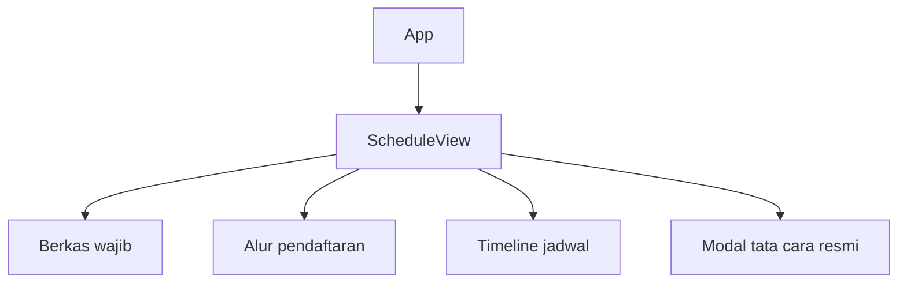
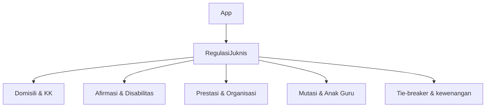
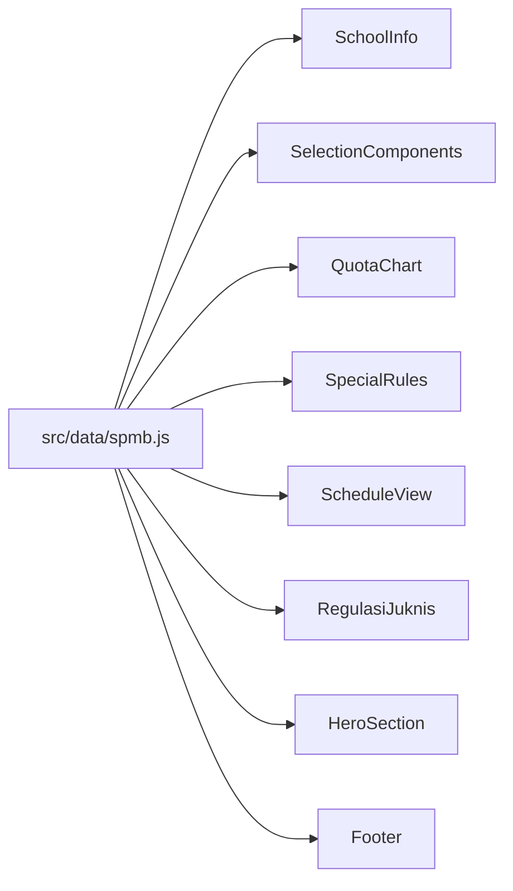

# Arsitektur Proyek SPMB 2026

Dokumen ini merangkum struktur folder, alur state dan event, serta komponen per tab utama pada aplikasi SPMB 2026 SMKN 4 Surakarta.

## 1) Peta Arsitektur Per Folder

### Fungsi Tiap Folder

- `src/app/`: lapisan routing Next.js App Router dan metadata global.
- `src/components/`: semua UI utama per layar dan modal interaktif.
- `src/data/`: sumber data statis tunggal untuk sekolah, jurusan, kuota, jadwal, dan regulasi.
- `public/`: aset gambar dan file statis yang langsung dipanggil UI.
- `scratch/`: skrip bantu analisis data lokal dan hasil ekstraksi dokumen.
- root file seperti `README.md` dan `gemini.md`: dokumentasi dan catatan arsitektur.

## 2) Peta Alur State dan Event

### State Inti di `src/App.jsx`

- `activeView`: menentukan layar utama yang sedang tampil.
- `activeSlide`: menentukan kolom/sub-layar aktif pada mode yang memakai tiga panel.
- `isSettingsOpen`: membuka dan menutup modal pengaturan kiosk.
- `animationsEnabled`: menghidupkan atau mematikan transisi animasi global lewat `MotionConfig`.
- `autoSlideshowEnabled`: memicu rotasi tab otomatis.
- `slideshowInterval`: durasi perpindahan tab otomatis.

### Event Penting

- Klik tab `sekolah`, `spmb`, `jadwal`, atau `regulasi` mengubah `activeView`.
- Klik dot atau tombol prev/next mengubah `activeSlide`.
- Auto slideshow memutar urutan `sekolah -> spmb -> jadwal -> regulasi -> sekolah`.
- Klik kartu tertentu membuka modal internal di `SpecialRules`, `ScheduleView`, atau `SelectionComponents`.

## 3) Diagram Komponen Per Tab

### Tab Profil Sekolah

- Fokus: profil institusi, sejarah, jurusan, dan fasilitas.
- Data utama: `sekolah`, `identitasStatus`, `sejarahSingkat`, `programKeahlian`, `fasilitasUnit`.

### Tab Info SPMB

- Fokus: penjelasan jalur seleksi, pembagian kuota, dan aturan khusus.
- Data utama: `komponenSeleksi`, `kuotaJalur`, `ketentuanKhusus`.

### Tab Jadwal SPMB

- Fokus: dokumen yang dibawa, urutan pendaftaran, dan jadwal resmi.
- Data utama: `jadwalSeleksi` dari `src/data/spmb.js`.

### Tab Regulasi & Juknis

- Fokus: referensi kebijakan yang lebih rinci dan berbasis topik.
- Komponen ini paling mandiri, karena ia mengelola tab topik internal sendiri.

## 4) Ringkasan Peran Komponen Global

- `HeroSection`: header visual utama, branding, dan link portal resmi.
- `WarningBanner`: peringatan resmi gratis dan bebas pungutan.
- `Footer`: kontak, media sosial, dan tautan resmi sekolah.
- `layout.jsx`: metadata, font, analytics, dan kerangka HTML global.
- `page.jsx`: entry point yang memuat app client secara dinamis.

## 5) Hubungan Data -> UI

Intinya, `src/data/spmb.js` adalah pusat konten. `src/App.jsx` hanya mengatur tata letak, state, dan perpindahan layar.

## 6) Titik Edit Paling Cocok Untuk Fitur Baru

Kalau mau menambah fitur baru, urutan edit yang paling masuk akal biasanya begini:

- **Tambah konten atau aturan baru**: mulai dari `src/data/spmb.js`.
- **Tambah komponen tampilan baru**: buat file baru di `src/components/`.
- **Tambah tab atau layar baru**: ubah `src/App.jsx` untuk menambah state `activeView` dan routing tampilan.
- **Ubah metadata, font, atau analytics global**: edit `src/app/layout.jsx`.
- **Ubah cara halaman utama dimuat**: edit `src/app/page.jsx`.
- **Ubah aset gambar/logo/sponsor**: taruh atau ganti file di `public/`.

### Prioritas Edit yang Paling Efisien

1. `src/data/spmb.js` kalau perubahan hanya menyentuh isi data.
2. `src/components/*.jsx` kalau perubahan menyentuh satu layar atau modal tertentu.
3. `src/App.jsx` kalau perubahan menyentuh navigasi, tab, atau layout global.

### Contoh Cepat

- Kalau ingin menambah kartu informasi baru di tab SPMB, paling sering cukup edit `src/data/spmb.js` dan `src/components/SelectionComponents.jsx`.
- Kalau ingin menambah tab baru, hampir pasti perlu edit `src/App.jsx` dan menambah komponen baru di `src/components/`.
- Kalau ingin menambah halaman profil sekolah baru, biasanya paling aman buat komponen baru lalu pasang di `src/App.jsx` sebagai view tambahan.
