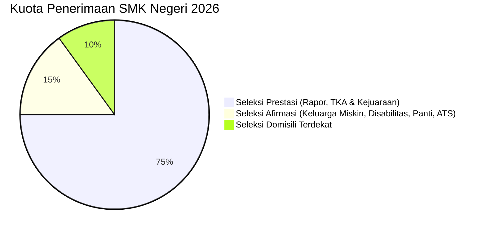

# Laporan Analisis Juknis Resmi SPMB SMK Negeri Jawa Tengah 2026

Laporan ini menyajikan analisis mendalam dan terperinci mengenai aturan hukum, jalur penerimaan, pembagian kuota resmi, serta persyaratan teknis bagi **Sekolah Menengah Kejuruan (SMK) Negeri** di Provinsi Jawa Tengah berdasarkan **Keputusan Gubernur Jawa Tengah Nomor 100.3.3.1/117 Tahun 2026** (ditetapkan 30 April 2026).

---

## 1. Landasan Hukum & Masa Berlaku
* **SK Gubernur Jateng Nomor:** `100.3.3.1/117 Tahun 2026` tentang Petunjuk Teknis Penyelenggaraan Sistem Penerimaan Murid Baru pada SMA, SMK, dan SLB Provinsi Jawa Tengah.
* **Pejabat Penandatangan:** Gubernur Jawa Tengah **Ahmad Luthfi** di Semarang pada **30 April 2026**.
* **Status Regulasi:** Mencabut dan menyatakan tidak berlaku SK Gubernur Nomor `100.3.3.1/135 Tahun 2025`.
* **Masa Berlaku:** Tahun Ajaran 2026/2027.

---

## 2. Paradigma Baru Penerimaan SMK Negeri
> [!IMPORTANT]
> Berbeda secara mendasar dengan SMA yang menerapkan sistem Jalur Zonasi (Domisili), **SMK Negeri tidak menggunakan sistem jalur pendaftaran konvensional**. Seleksi SMK Negeri didasarkan pada kombinasi performa akademik (Rapor + Tes Kemampuan Akademik/TKA), prestasi non-akademik, afirmasi ekonomi, dan domisili jarak terdekat terpadu.

---

## 3. Pembagian Kuota & Jalur Seleksi Resmi SMK Negeri

### A. Seleksi Prestasi (Kuota: Paling Sedikit 75%)
Merupakan jalur utama penerimaan SMK Negeri. Seleksi dihitung secara terintegrasi berdasarkan formula:
$$\text{Nilai Akhir Seleksi} = \text{Nilai Rapor (Sem 1-5)} + \text{Nilai Tes Kemampuan Akademik (TKA)} + \text{Bobot Nilai Kejuaraan (jika ada)}$$

* **Mata Pelajaran Rapor:** Rapor semester 1 s.d. 5 dari jenjang SMP/MTs/Sederajat pada mata pelajaran yang ditentukan oleh Dinas.
* **Ketentuan Bukti Kejuaraan:** 
  * Diterbitkan paling lama **3 tahun** sebelum pendaftaran SPMB.
  * Kejuaraan tidak berjenjang wajib dikurasi oleh **Pusat Prestasi Nasional (Puspresnas)** atau mendapat pengesahan Kepala SMP asal beserta Dinas Kepemudaan/Olahraga Kabupaten/Kota setempat.
* **Kesempatan Khusus Bidang Seni:** 
  * Disediakan kuota khusus **paling banyak 50%** dari kuota Seleksi Prestasi bagi calon murid yang mendaftar pada Program Keahlian: **Seni Rupa**, **Desain & Produksi Kriya**, serta **Seni Pertunjukan**.
* **Aturan Pemecah Nilai Sama (Tie-Breaker):** Jika terdapat nilai akhir seleksi prestasi yang sama pada batas kuota terakhir, prioritas ditentukan berdasarkan:
  1. Jarak domisili calon murid yang berada pada Kabupaten/Kota atau Provinsi yang sama dengan SMK tujuan.
  2. Usia calon murid yang lebih tua (berdasarkan Akta Kelahiran).

### B. Seleksi Afirmasi (Kuota: Paling Sedikit 15%)
Diperuntukkan khusus bagi pemerataan akses pendidikan bagi kalangan rentan dengan pembagian sub-kuota internal:
1. **Keluarga Ekonomi Tidak Mampu:** Calon murid harus terdata dalam **Data Tunggal Sosial dan Ekonomi Nasional (DTSEN)** pada kategori **Desil 1 sampai dengan Desil 4**.
2. **Penyandang Disabilitas (Kuota Maksimal 2% dari total daya tampung):** Dibuktikan dengan Kartu Penyandang Disabilitas resmi Kemensos, surat keterangan dokter/psikolog, atau rekomendasi Tim Asesmen Dinas Pendidikan.
3. **Anak Panti (Kuota Maksimal 3% dari total daya tampung):** Harus tercatat dalam data Anak Panti asuhan Prioritas 1 dan 2 yang ditetapkan oleh Dinas Sosial Provinsi Jawa Tengah.
4. **Anak Tidak Sekolah / ATS (Kuota Maksimal 2% dari total daya tampung):**
   * Dibuktikan dengan Surat Keterangan Kepala Desa/Lurah setempat dan Surat Pernyataan Orang Tua/Wali.
   * Kriteria ATS: Telah berstatus tidak sekolah (putus sekolah/tidak melanjutkan setelah lulus SMP) sekurang-kurangnya **1 tahun** dan usia **maksimal 21 tahun** per 1 Juli 2026.
* **Pengalihan Kuota:** Apabila kuota Seleksi Afirmasi tidak terpenuhi, sisa kuota dialihkan ke **Seleksi Prestasi**.

### C. Seleksi Domisili Terdekat (Kuota: Paling Banyak 10%)
* Didasarkan atas domisili alamat pada **Kartu Keluarga (KK)** yang diterbitkan dan/atau telah tinggal **paling singkat 1 (satu) tahun** sebelum tanggal pertama pendaftaran SPMB.
* **Prioritas Tanah Kas Desa:** Khusus SMK Negeri yang berdiri di atas lahan tanah kas desa, ketentuan domisili terdekat wajib memberikan **prioritas utama** kepada calon murid warga desa setempat.
* **Prioritas Wilayah Asal:** Sekolah memprioritaskan calon murid yang memiliki KK dalam wilayah SPMB pada satu Kabupaten/Kota yang sama dengan SMP asal.

---

## 4. Ketentuan Kapasitas & Rombongan Belajar (Rombel) SMK
* **Kapasitas Rombel Kelas:** Paling sedikit **15 Murid** dan paling banyak **36 Murid** per kelas.
* **Kapasitas Total Satuan Pendidikan:** Paling sedikit **3 Rombel** dan paling banyak **72 Rombel** secara keseluruhan (dengan batas maksimal **24 Rombel** per tingkat kelas).
* **Pemenuhan Daya Tampung:** Jika kuota belum terpenuhi setelah pengumuman, sekolah dapat mengisi sisa daya tampung (akibat kurang pendaftar atau ada yang lulus tapi tidak daftar ulang) atas persetujuan Kepala Dinas.

---

## 5. Kebijakan Anti-Pungutan & Program Kemitraan
* > [!WARNING]
  > **Dilarang Keras Melakukan Pungutan:** Satuan Pendidikan SMK Negeri dan Swasta pelaksana Program Kemitraan dilarang keras memungut biaya, sumbangan, atau pungutan dalam bentuk apa pun yang berkaitan dengan pelaksanaan SPMB.
* **Program Kemitraan Swasta:** Mengizinkan kerja sama dengan sekolah swasta (akreditasi minimal B) untuk menampung siswa tidak mampu (Afirmasi) dengan pembiayaan penuh ditanggung oleh Pemprov Jateng (Bebas Biaya).

---

## 6. Pengecualian Juknis SPMB
Aturan di dalam Juknis Keputusan Gubernur ini **tidak berlaku** (dikecualikan dan diatur khusus) untuk:
1. **SMK Negeri Boarding School** (Pola asrama penuh, misal SMKN Jateng).
2. **SMK Negeri Semi Boarding School** (Terbatas pada daya tampung yang ditentukan).
3. **Sekolah Luar Biasa (SLB)**.
4. SMAN Keberbakatan Olahraga Jateng & Kelas Khusus Olahraga (KKO).
5. Kelas Jauh dan Kelas Virtual.
6. **SMK Negeri Karimunjawa** (Kabupaten Jepara) dan SMA Negeri Kampung Laut (Kabupaten Cilacap).

---

## 7. Sistem Cadangan & Daftar Ulang
* Calon murid yang tidak diterima pada pengumuman utama otomatis berstatus sebagai **Cadangan**.
* Calon murid yang lolos utama **wajib melakukan daftar ulang**. Jika tidak daftar ulang sesuai jadwal, dinyatakan mengundurkan diri dan langsung digantikan oleh cadangan berdasarkan urutan nilai seleksi.
